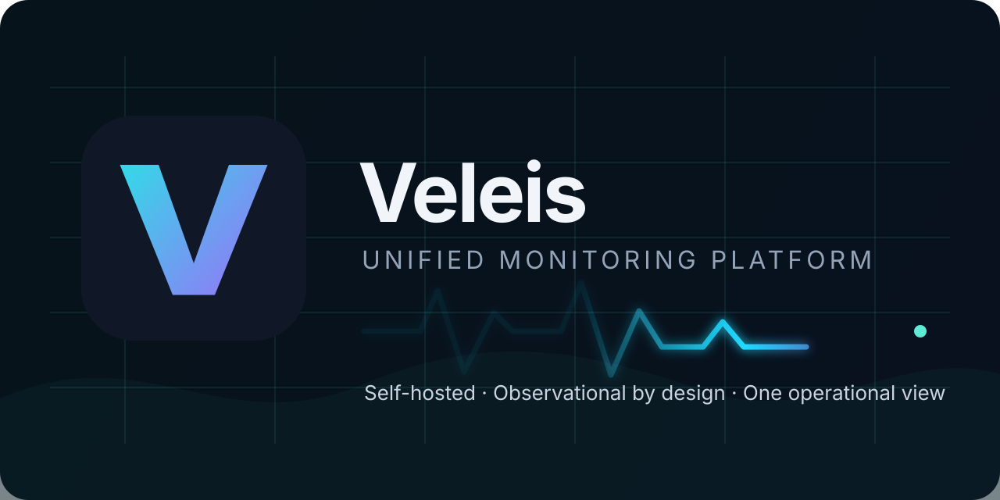
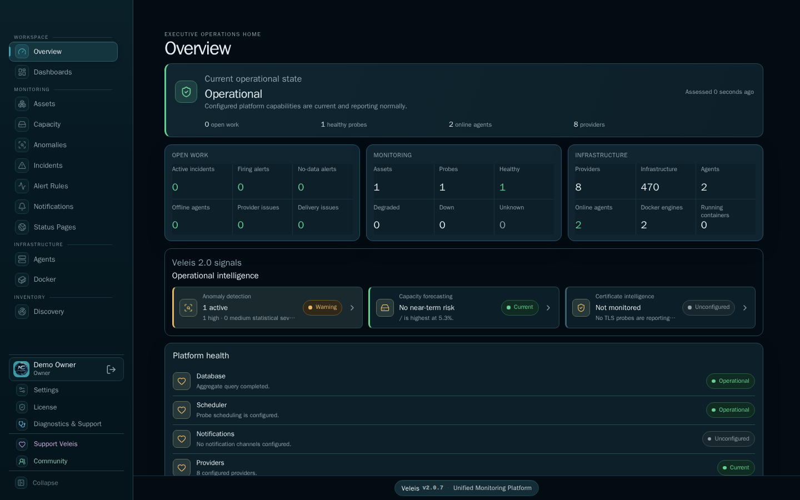
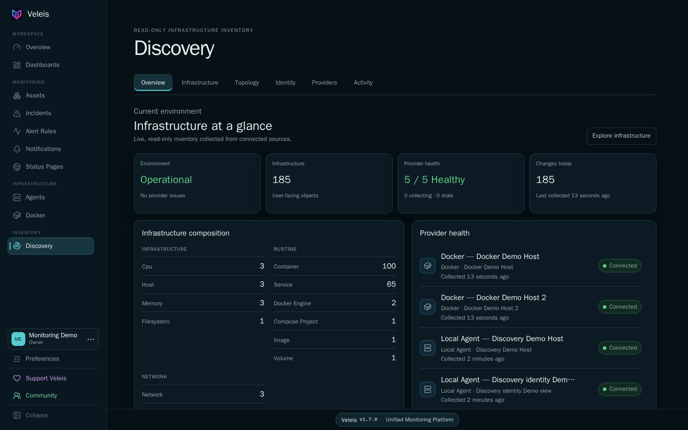
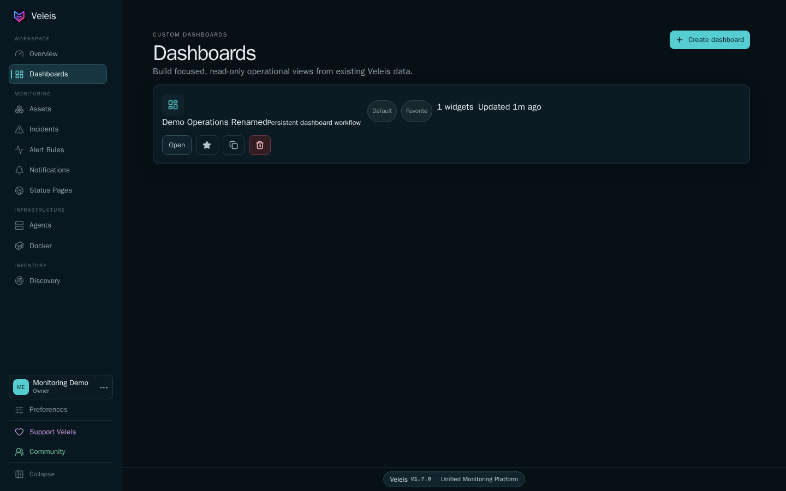
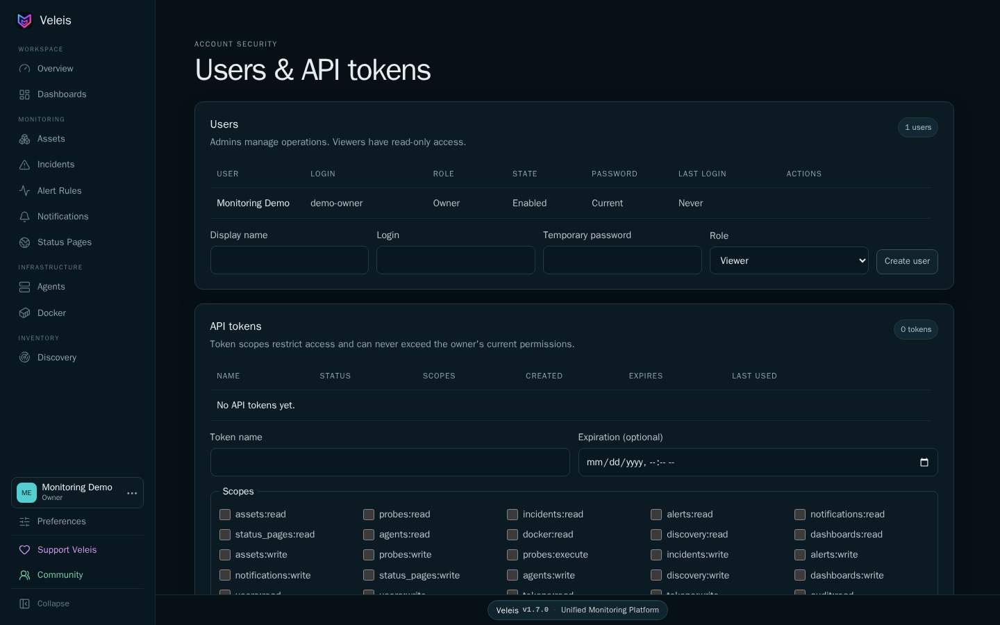

# Veleis

## Unified Monitoring Platform



[](https://github.com/NyxCloudRO/Veleis/releases/tag/v1.8.2)
[](https://hub.docker.com/r/nyxmael/veleis)
[](docs/SYSTEM-REQUIREMENTS.md)
[](docs/SYSTEM-REQUIREMENTS.md)
[](LICENSE)

**A modern, self-hosted unified monitoring and observability platform.**

Veleis brings service availability, Linux hosts, Docker, Proxmox, infrastructure
Discovery, dashboards, alerts, incidents, notifications, and public status
communication into one coherent product. PostgreSQL and TimescaleDB preserve
current state and history locally under your control.

> Veleis observes infrastructure. It does not control infrastructure.
> Docker, Proxmox, agents, and Discovery are intentionally observational—there
> are no VM/container start, stop, reboot, remediation, or remote-shell actions.

Current stable release: **Veleis 1.8.2** · Schema 33 · linux/amd64

## Quick start

On a clean, supported Ubuntu or Debian host with `curl` available, run:

```bash
curl -fsSL https://raw.githubusercontent.com/NyxCloudRO/Veleis/main/install.sh | bash
```

The installer detects root or ordinary sudo access, installs missing Docker
components from the operating-system repositories, creates `/opt/veleis`,
generates unique secrets and a self-signed TLS certificate, pulls the immutable
`nyxmael/veleis:1.8.2` image, provisions TimescaleDB, applies schema migrations,
and waits for HTTPS readiness.

When installation finishes, open the printed `https://<detected-ip>/` address.
Your browser will warn about the default self-signed certificate; traffic is
still encrypted. Continue only after confirming you reached your Veleis host,
then create the first Owner account. There are no default credentials.

[Installation guide](docs/INSTALLATION.md) ·
[System requirements](docs/SYSTEM-REQUIREMENTS.md) ·
[Troubleshooting](docs/TROUBLESHOOTING.md)

## Why Veleis?

Monitoring stacks often split availability checks, host telemetry,
infrastructure inventory, dashboards, incident response, and status
communication across separate systems. Veleis connects these views while
preserving their source truth:

- an outage can be investigated alongside the asset, host, container, and
  dependency context that explains it;
- current health and historical evidence share one durable data model;
- operators get one responsive application without handing infrastructure
  control to the monitoring plane;
- local roles, scoped tokens, audit history, retention, and private-by-default
  status publishing provide operational governance from the first install.

## What Veleis monitors

| Area | Included in 1.8.2 |
| ---- | ----------------- |
| Service availability | HTTP/HTTPS, ICMP/Ping, TCP, DNS, SMTP, IMAP, and dedicated TLS certificate probes |
| Linux hosts | Optional Ravyr agents: CPU, memory, storage, network, runtime, service, process, and inventory observations |
| Docker | Engines, containers, runtime state, metrics, events, images, volumes, networks, and availability incidents |
| Proxmox | Read-only nodes, VMs, LXCs, storage, networks, inventory metadata, and relationships |
| Infrastructure | Normalized Discovery inventory, history, changes, search, hierarchy, topology, and explicit cross-provider identity trust |

## Product capabilities

### Monitoring

- Scheduled and manual probes with bounded execution, results, analytics, and
  shared incident lifecycle.
- Independent TLS certificate trust, identity, validity, and expiry monitoring.
- Alert rules, silences, maintenance windows, retries, and durable webhook,
  Discord webhook, SMTP email notifications.
- Dependency-aware incident explanations and optional notification-only
  suppression without hiding raw incidents.

### Infrastructure and Discovery

- Outbound-only Ravyr Linux agents with bounded local retry spool and a signed,
  progressive, rollback-safe zero-touch lifecycle for Ravyr-owned software.
- Read-only Docker and GET-only Proxmox observations.
- Provider-owned inventory and relationships, historical changes, stable
  fingerprints, bounded topology, and explicitly audited cross-provider trust.
- No automatic same-name merging and no infrastructure mutation.

### Operations

- Unified Overview and asset details.
- Supported `veleis` status, log, complete backup, validated restore, and
  compatibility-gated upgrade commands.
- User-owned custom dashboards with first-class Discovery and Proxmox widgets,
  deterministic provider scope, bounded operational lists, and freshness state.
- Incident acknowledgment, resolution, recovery history, and audit context.
- Private-by-default public Status Pages with paginated component administration,
  bulk actions, scalable ordering, and privacy-safe incident updates.
- Configurable raw probe-result retention and capacity visibility.

### Security and governance

- Local first-Owner bootstrap; Owner, Admin, and read-only Viewer roles.
- Server-side sessions, CSRF protection, TOTP/recovery, account disable/reset,
  forced password replacement, and immutable audit history.
- Hashed, scoped, expiring, revocable personal API tokens.
- Encrypted stored integration credentials and installation-specific secrets.
- HTTPS enabled by default.

See the [complete feature inventory](docs/FEATURES.md).

## Product preview

Screenshots use isolated demonstration data created specifically for public
documentation.

| Overview | Discovery |
| -------- | --------- |
| [](assets/screenshots/overview.png) | [](assets/screenshots/discovery.png) |

| Dashboards | Security |
| ---------- | -------- |
| [](assets/screenshots/dashboards.png) | [](assets/screenshots/security.png) |

## Requirements

| | Minimum | Recommended starting point |
| --- | --- | --- |
| Host | Ubuntu 24.04.4 LTS or Debian 13.6 | Dedicated current installation of either tested release |
| Architecture | amd64 | amd64 |
| CPU | 2 vCPU | 4 vCPU |
| Memory | 4 GiB | 8 GiB |
| Free storage | 20 GiB | 50+ GiB SSD, sized for retention |
| Network | Internet access during installation; TCP 443 available | Stable outbound connectivity to monitored targets and notification endpoints |

Sizing depends on probe frequency, agents, container inventory, and retention.
PostgreSQL is internal to Compose and is not exposed on the host. The installer
does not change firewall rules; allow inbound TCP 443 where required.

See [System requirements](docs/SYSTEM-REQUIREMENTS.md) for browser and outbound
network details.

## First run

1. Open the HTTPS URL printed by the installer.
2. Confirm the address is your Veleis host and proceed through the expected
   self-signed certificate warning.
3. Create the first Owner account with your own credentials.
4. Sign in and begin adding assets, probes, agents, and providers.

## Routine operation

```bash
sudo veleis status
sudo veleis version
sudo veleis logs --tail=200 veleis
sudo veleis backup
```

Existing 1.7.1, 1.8.0, and 1.8.1 installations can upgrade with
`sudo veleis upgrade`; the exact version alternative is
`sudo veleis upgrade 1.8.2`. Installations created before the lifecycle command
was published can add it with the bootstrap documented in
[Installation](docs/INSTALLATION.md).
Do not remove the `veleis-database-pg18` volume or `/opt/veleis` data. See
[Operations](docs/OPERATIONS.md) and [Backup and restore](docs/BACKUP-RESTORE.md).

## Documentation

- [Installation](docs/INSTALLATION.md)
- [System requirements](docs/SYSTEM-REQUIREMENTS.md)
- [Features](docs/FEATURES.md)
- [Ravyr fleet lifecycle](docs/RAVYR.md)
- [Status Pages](docs/STATUS-PAGES.md)
- [Alert Rules and Active Alerts](docs/ALERTS.md)
- [Custom dashboards](docs/DASHBOARDS.md)
- [Proxmox setup](docs/PROXMOX.md)
- [Architecture](docs/ARCHITECTURE.md)
- [Configuration and data](docs/CONFIGURATION.md)
- [Operations](docs/OPERATIONS.md)
- [Docker image and tag policy](docs/DOCKER.md)
- [Security](docs/SECURITY.md)
- [Troubleshooting](docs/TROUBLESHOOTING.md)
- [Upgrading](docs/UPGRADING.md)
- [Backup and restore](docs/BACKUP-RESTORE.md)
- [Releases and supported versions](docs/RELEASES.md)
- [Production operability hardening](docs/OPERABILITY-HARDENING.md)
- [FAQ](docs/FAQ.md)

## Distribution and source model

Veleis is **proprietary software**. This public repository contains only the
installer, supported deployment definition, public documentation, sanitized
images, and release metadata. It is not the Veleis application source
repository, and publication here does not make Veleis open source.

Official application binaries are distributed as container images at
[docker.io/nyxmael/veleis](https://hub.docker.com/r/nyxmael/veleis). Use is
governed by the [Veleis Proprietary Distribution License](LICENSE).

## Current limitations

- linux/amd64 only; tested on Ubuntu 24.04.4 LTS and Debian 13.6.
- Default HTTPS uses a unique self-signed certificate.
- Restore currently requires the same Veleis version, linux/amd64, PostgreSQL
  18, TimescaleDB 2.28.3, and the accepted Compose topology.
- Proxmox dashboard widgets show normalized inventory/state; historical Proxmox
  CPU and memory timeseries are not persisted in this release.
- Automatic database downgrade is not supported.
- Automated uninstall is not published.
- Public custom-certificate/reverse-proxy operations, image signing, SBOM, and
  provenance attestations are pending.

## Support and security

Join the [NyxCloud Community](https://community.nyxcloud.ro/) for public product
discussion. Use [GitHub Issues](https://github.com/NyxCloudRO/Veleis/issues) for
reproducible bugs, documentation problems, and focused feature requests. Read
[SUPPORT.md](SUPPORT.md) before posting logs. Report vulnerabilities privately
according to [SECURITY.md](SECURITY.md).

[](https://buymeacoffee.com/nyxmael)

Copyright © 2026 Nyxmael. Veleis is proprietary software.
